# QC Assistant — User's Guide

*Drawing ballooning and inspection report builder. Version covered: v0.6.0.*

QC Assistant turns an engineering drawing PDF into a submittable First Article Inspection (FAI) package: you balloon the dimensions on the drawing, enter measured samples, and export a ballooned PDF plus an Excel FAI workbook. Everything runs locally in your browser — there is no server, no account, and no upload of your drawing anywhere.

## The golden path

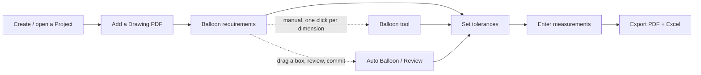

Jump to a section:

1. [Projects & Drawings](#1-projects--drawings)
2. [Uploading & Viewing a Drawing](#2-uploading--viewing-a-drawing)
3. [Capturing Text & OCR](#3-capturing-text--ocr)
4. [Ballooning](#4-ballooning)
5. [Auto Balloon (Review tool)](#5-auto-balloon-review-tool)
6. [Characteristics Table](#6-characteristics-table)
7. [Tolerance Table](#7-tolerance-table)
8. [Measurements & Status Logic](#8-measurements--status-logic)
9. [Settings](#9-settings)
10. [Exporting](#10-exporting)
11. [Keyboard Shortcuts](#11-keyboard-shortcuts)
12. [Troubleshooting / FAQ](#12-troubleshooting--faq)
13. [Appendix: Version History](#13-appendix-version-history)

---

## 1. Projects & Drawings

Everything is stored locally in your browser (IndexedDB) under **Projects**. A project holds one or more **Drawings**; each drawing keeps its own PDF, metadata, balloons, tolerances, and measurements.

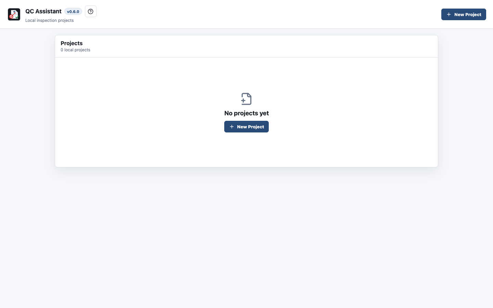

Click **New Project**, name it, and QC Assistant creates the project and drops you straight into the workspace with an empty drawing slot.

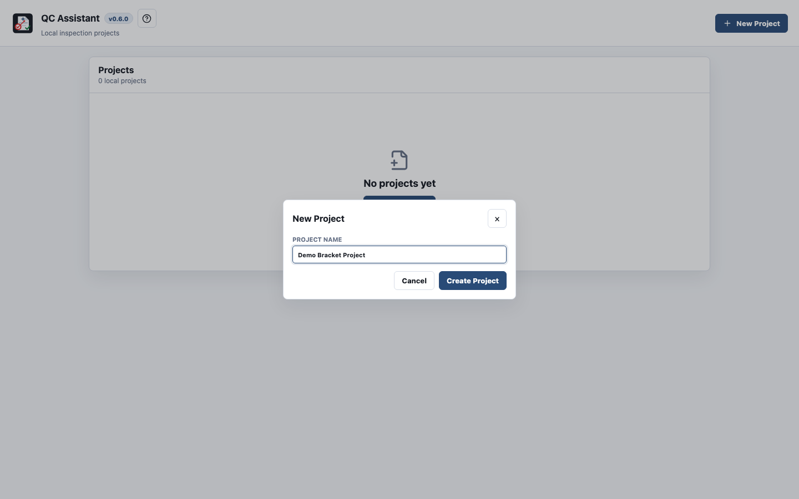

To manage a project's drawings without opening the workspace, go back to **Projects** and click **Manage** on a project card. From here you can edit the **Project Name**, **Project Code**, **Project Owner**, **Estimated Delivery Date**, and **Notes**, and add, rename, or delete drawings.

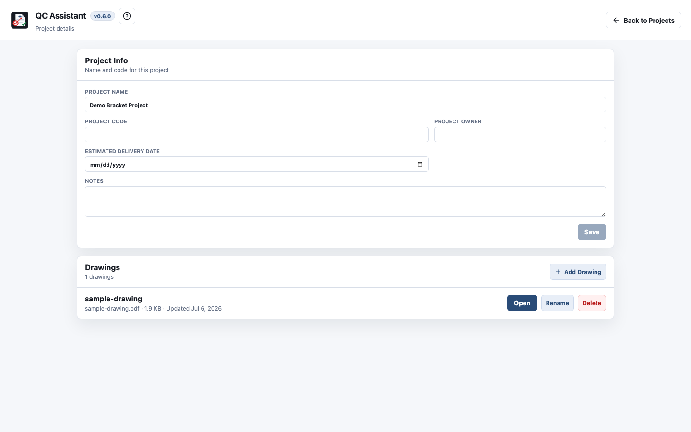

- **Add Drawing** accepts any PDF; it becomes a new drawing entry in the project.
- Each drawing card's **Open** button loads it into the workspace; **Rename** / **Delete** work with a confirmation.
- Deleting a project or drawing removes its balloons, measurements, and stored PDF bytes — this cannot be undone.

**Storage limits:** a project can hold up to **25 drawings**. You'll see a warning if a single PDF exceeds ~25 MB, or if a project's total storage exceeds ~500 MB. If your browser's storage quota is nearly full, saving will fail with a clear "Local storage quota exceeded" message — free up space by deleting old drawings/projects.

**Autosave:** while working in a drawing, changes save automatically (debounced ~800ms) to IndexedDB. The last project/drawing you had open is remembered and reopened automatically next time.

---

## 2. Uploading & Viewing a Drawing

If a drawing has no PDF yet, the workspace shows an upload prompt:

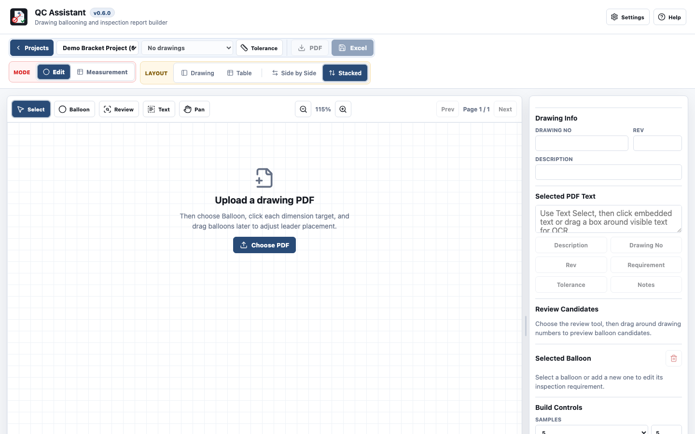

Once a PDF is loaded, use the drawing toolbar to page through multi-page drawings and zoom from 65% to 220% in 10% steps.

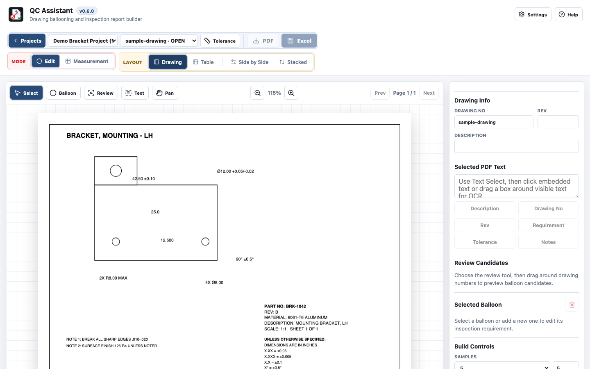

### Edit mode vs. Measurement mode

The **Mode** toggle switches the whole workspace:

- **Edit** — full toolset: balloon placement, auto-balloon, text/OCR capture, tolerance table, metadata editing.
- **Measurement** — a locked-down, view-only version of the drawing plus an editable measurement table. Balloon positions and requirement definitions can't be changed here — only sample values and notes. Use this mode for the actual inspection data-entry step so nobody accidentally moves a balloon while measuring.

### Layout modes

Under **Layout** (Edit mode only), choose how the drawing canvas, characteristics table, and inspector panel are arranged:

| Layout | Shows |
|---|---|
| **Drawing** | Canvas + inspector only, no table — best for placing/adjusting balloons |
| **Table** | Characteristics table only, full width — best for bulk-editing requirements |
| **Side by Side** | Canvas and table side by side, inspector below | 
| **Stacked** (default) | Canvas and inspector on top, table below |

Panel sizes are resizable by dragging the divider between them, and your sizing is remembered.

---

## 3. Capturing Text & OCR

Rather than retyping values from the drawing, use the **Text Select** tool (`T`) to pull text straight off the PDF into the "Selected PDF Text" box in the right-hand inspector:

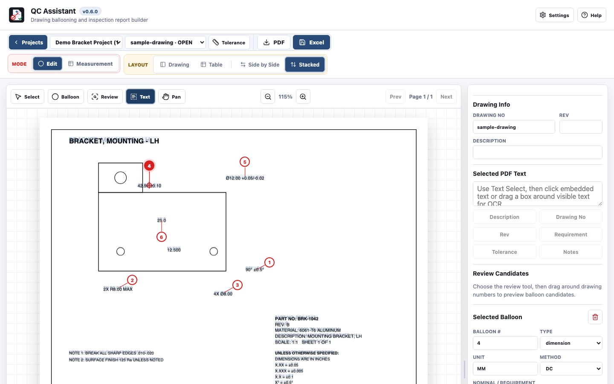

- Click any **embedded PDF text** item (real text, not a raster scan) to capture it.
- If the text isn't selectable (e.g. a scanned/rasterized drawing), **drag a rectangle** over it instead — QC Assistant runs on-device OCR (Tesseract.js) on that cropped region and drops the recognized text into the same box.
- Once text is captured, click one of the buttons below it — **Description**, **Drawing No**, **Rev**, **Requirement**, **Tolerance**, or **Notes** — to push it into that field, or into the currently-selected balloon's requirement/tolerance/notes.

This is the fastest way to fill in the drawing's title-block metadata (Drawing No, Rev, Description) and to seed a balloon's nominal/tolerance from the drawing's own callout text.

---

## 4. Ballooning

Ballooning is how you turn a dimension on the drawing into a tracked inspection requirement.

1. Select the **Balloon** tool (`B`).
2. Click on (or near) a dimension callout. QC Assistant snaps the balloon's leader target to the nearest recognized dimension text and pre-fills the nominal value and tolerance from it when it can parse them (e.g. `42.50 ±0.10`, `Ø12.00 +0.05/-0.02`, `90° ±0.5°`).
3. The balloon is placed with a default offset and leader line; **drag the numbered circle or the leader target** independently to fine-tune placement.
4. Balloons number sequentially as you place them (1, 2, 3, …). Deleting a balloon renumbers everything after it.

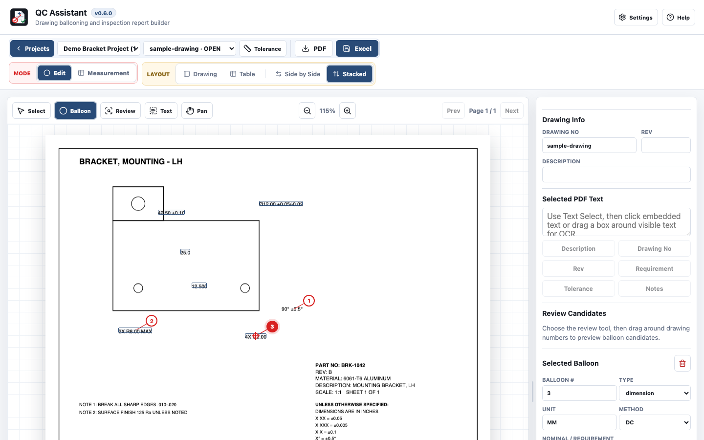

- **Single-click** a balloon to select it (its details appear in "Selected Balloon" on the right).
- **Double-click**, or press `E` while selected, opens a small popover to **reassign its number** or **delete** it.
- **Add Row** (in the "Build Controls" section of the inspector) creates a characteristic with no balloon yet placed on the drawing — useful for notes/visual checks that don't map to a specific dimension.
- **Demo Rows** seeds 7 example characteristics for exploring the app without a real drawing.
- **Clear Drawing Data** wipes metadata + all characteristics for the active drawing; **Clear All Balloons** (in the table panel) clears just the characteristics table. Both ask for confirmation first.

---

## 5. Auto Balloon (Review tool)

For drawings with many dimensions, the **Review** tool (`A`) detects and pre-numbers several balloons at once instead of clicking each one individually.

1. Select **Review** and drag a rectangle around a cluster of dimension callouts.
2. QC Assistant first tries to detect dimension-shaped text from the PDF's **embedded text layer**. If nothing usable is found in that region (common on scanned/rasterized drawings), it automatically falls back to running **OCR** on the cropped area.
3. Detected candidates are de-duplicated, filtered for obvious noise (like page numbers), positioned along the nearest edge of your selection box, and numbered in clockwise order.
4. Review the candidate list in the inspector, remove any you don't want, then click **Add balloons** to commit them — each one is parsed for a nominal value and tolerance just like a manually placed balloon.

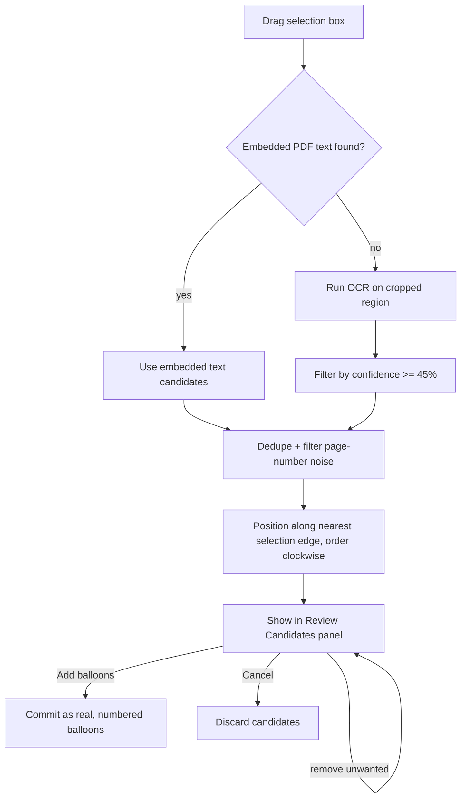

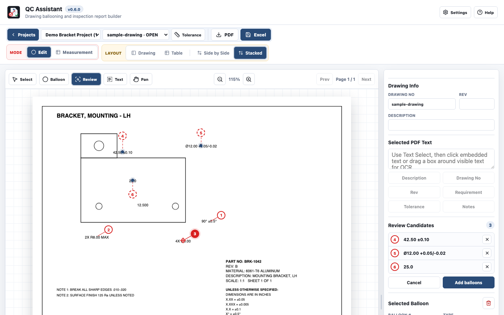

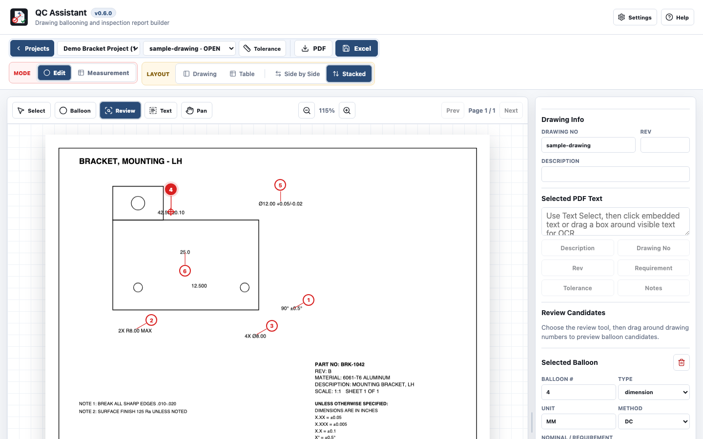

---

## 6. Characteristics Table

Every balloon has a matching row in the **QC / FAI Characteristics** table. Columns:

| Column | Notes |
|---|---|
| **ID #** | Balloon number; editable — reassigning it here also renumbers the balloon on the drawing |
| **Type** | `dimension`, `gdt`, `note`, or `visual`. Changing Type auto-fills a sensible default **Method** (`dimension`→DC, `gdt`→CMM, `note`/`visual`→VS) unless you've already set one |
| **Unit** | Free text (e.g. `MM`, `IN`) |
| **Nominal / Requirement** | The target value, or free text for notes/visual checks |
| **+Tol / −Tol** | Split tolerance inputs — supports symmetric (`±0.1`), asymmetric (`+0.1/-0.05`), and `MAX`/`MIN`-only tolerances |
| **USL / LSL** | Computed automatically from nominal + tolerance — read-only |
| **#1…#N** | One column per sample, count controlled by **Samples** in Build Controls (1, 3, 5, or 10 — or a custom number) |
| **Method** | Measurement method abbreviation (DC, CMM, VS, VMS, HG, MIC, CG, PP, TG, PG) |
| **Status** | Computed — see [Measurements & Status Logic](#8-measurements--status-logic) |
| **Notes** | Free text (editable in Measurement mode too) |

The table stays sorted by balloon number, and clicking a row selects that balloon on the drawing (and vice versa). In **Measurement mode** the same table renders read-only except for the sample columns and Notes — so the requirement definition can't drift while someone is taking measurements.

---

## 7. Tolerance Table

Rather than typing the same general tolerance into every dimension, QC Assistant reads the drawing's title-block tolerance note (e.g. *"X.XX = ±0.05"*, *".X ±0.1"*, *"X° = ±0.5°"*) and offers to apply it in bulk.

Open it from the toolbar's **Tolerance** button.

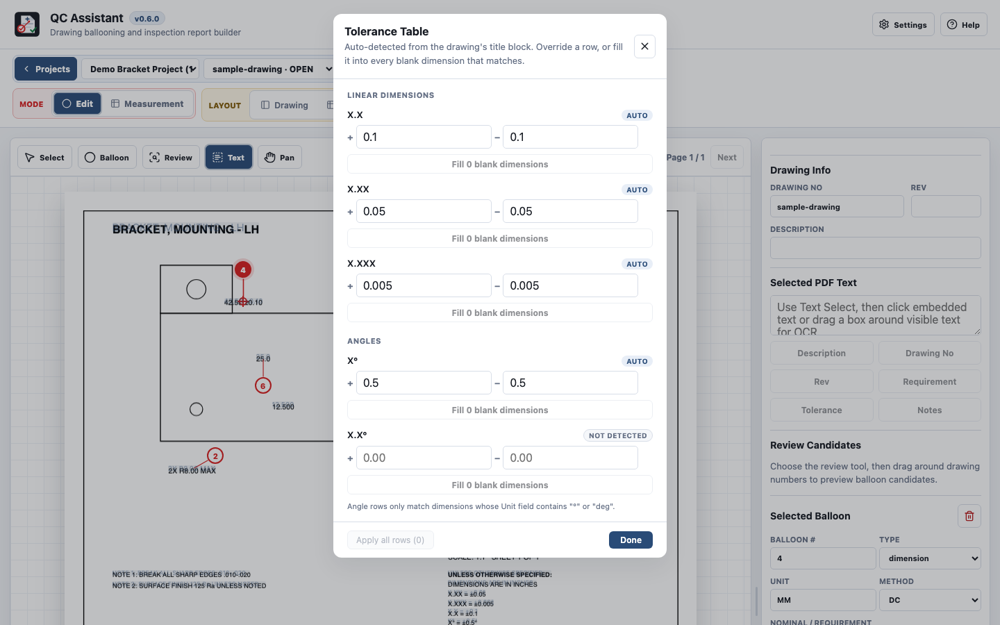

- Each row is keyed by **decimal-place count** (e.g. 1, 2, or 3 places after the decimal) for linear dimensions, and by decimal places for angles (only matched against dimensions whose Unit contains `°` or `deg`).
- A badge shows whether the value was **Auto**-detected, **Manual** (you overrode it), or **Not detected**.
- **Fill N blank dimensions** applies that bucket's tolerance to every matching dimension that doesn't already have one — it never overwrites a tolerance you've already entered.
- **Apply all rows** does the same across every bucket at once.
- Override any row manually, or hit **Reset** to go back to the auto-detected value.

---

## 8. Measurements & Status Logic

Switch to **Measurement** mode to enter sample values against each requirement, in a locked, view-only version of the drawing plus an editable table.

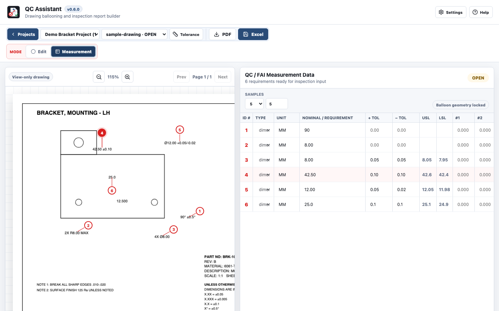

Each requirement's **Status** is computed conservatively — QC Assistant prefers to say "not finished" over incorrectly saying "passed":

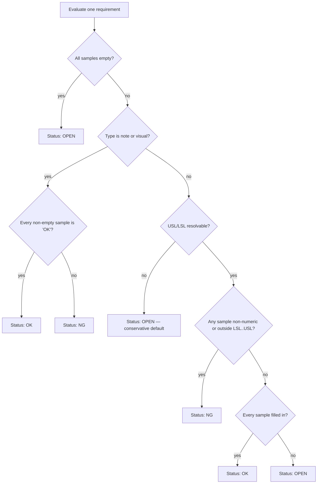

The overall **project/drawing status** rolls this up the same way everywhere it's shown (dashboard, drawing selector, workspace header):

- Any requirement **NG** → overall **FAIL**
- Else any requirement **OPEN** → overall **OPEN**
- Else → overall **PASS**

This means a half-filled inspection never silently reads as passing — it always reads as **OPEN** until it's actually complete, and any out-of-tolerance or non-numeric sample immediately fails it.

---

## 9. Settings

Open **Settings** (gear icon, top right) to adjust the toolbar and balloon appearance:

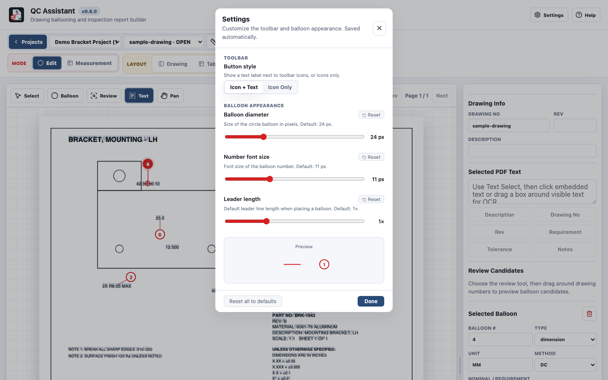

- **Button style**: Icon + Text or Icon Only for the toolbar buttons.
- **Balloon diameter** (16–48px) and **Number font size** (8–18px).
- **Leader length**: scales the default offset used when placing a new balloon (0.25× – 3×).

Changes apply live (see the preview) and are saved automatically to your browser, independent of any project — they follow you across all projects and drawings.

---

## 10. Exporting

Once your characteristics table has at least one row, the **PDF** and **Excel** buttons in the toolbar are enabled:

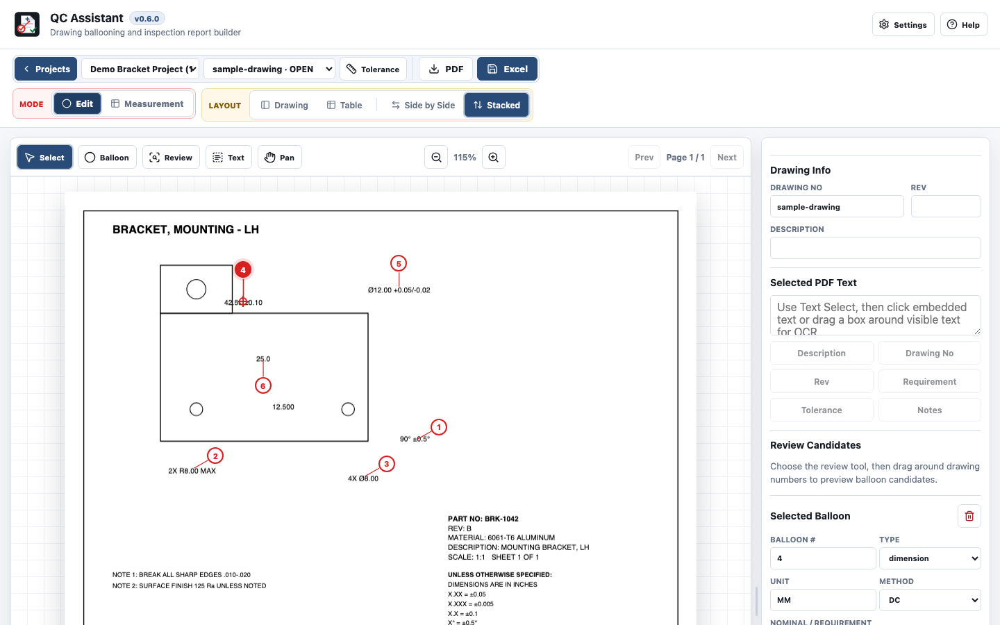

- **PDF** — downloads a copy of the original drawing PDF with a red circle, leader line, and bold balloon number drawn on top of each requirement's target location, on the correct page. Filename: `<drawing-file-name>_ballooned.pdf`.
- **Excel** — downloads a formatted "QC FAI" workbook: a header block (drawing name/description, rev/supplier, sample count, overall pass/fail), then one row per characteristic (sorted by balloon number) with ID #, Type, Unit, Nominal, Tolerance, USL, LSL, every sample column, computed MIN/MAX of the numeric samples, Method, computed Status, and Notes — plus a footer legend explaining the Method abbreviations. Filename: `<drawing-no or "inspection">_QC_FAI.xlsx`.

Both exports reflect exactly what's in the characteristics table at the moment you click — there's no separate "finalize" step.

---

## 11. Keyboard Shortcuts

Shortcuts are disabled while typing in any text field, and in Measurement mode (where there's nothing to switch tools for).

| Key | Action |
|---|---|
| `B` | Balloon tool |
| `A` | Review / Auto Balloon tool |
| `V` | Select tool |
| `H` | Pan tool |
| `T` | Text Select / OCR tool |
| `E` | Open edit/reassign/delete popover for the selected balloon |
| `Esc` | Close the topmost open thing — Settings/Tolerance dialog first, else Help, an edit popover, an in-progress OCR/auto-balloon drag, or a pending balloon target |

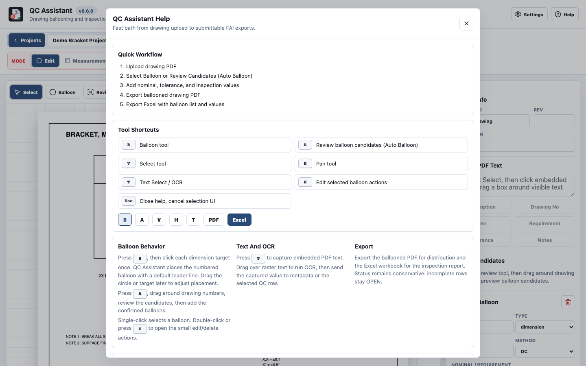

You can always reopen this reference in the app itself via the **Help** button (or `?`).

---

## 12. Troubleshooting / FAQ

**"Local storage quota exceeded" when saving.** Your browser's storage for this site is full. Delete unused drawings or projects, or use a smaller PDF, then try again.

**A requirement shows OPEN and I don't understand why.** OPEN means either: not every sample has been entered yet, or QC Assistant couldn't resolve a usable tolerance (no nominal, no tolerance, or a tolerance format it couldn't parse) — check the Tolerance Table and the requirement's +Tol/−Tol fields. QC Assistant intentionally never guesses OK when it isn't sure.

**Auto Balloon found nothing, or found garbage.** It only searches inside the rectangle you drag — try a tighter or looser box around just the numbers you want. Very low-confidence OCR words are already filtered out (below 45% confidence), and obvious page-number-style text is filtered too, but OCR on noisy scans can still miss or misread values — remove bad candidates before clicking **Add balloons**, or place that one manually with the Balloon tool instead.

**I can't edit a balloon's requirement in Measurement mode.** That's by design — Measurement mode locks the requirement definition (type, unit, nominal, tolerance, method) so measurement entry can't accidentally change what's being measured. Switch to Edit mode to change the requirement itself.

**My drawing has text I can't click with Text Select.** That means it's raster (scanned) rather than embedded PDF text. Drag a rectangle over it instead — Text Select automatically falls back to on-device OCR for that region.

---

## 13. Appendix: Version History

Sourced from the in-app Help dialog's changelog.

**v0.6.0** — Improved the UI overall. Icon buttons now support a text label alongside the icon, with a setting to choose Icon only or Icon + Text.

**v0.5.0** — Tolerance inputs now preserve common leading-decimal drawing values like `.005`, `+.005`, and `-.002`. The tolerance table can fill every blank dimension matching a drawing pattern in one pass without overwriting entered tolerances.

**v0.4.0** — Added settings to customize balloon appearance and behavior.

**v0.3.1** — Changing a balloon's type from the table now keeps the selected-balloon editor in sync. Type changes update the inspection method through one shared rule.

**v0.3.0** — Toolbar reorganized into project controls and drawing controls. Auto Balloon became a dedicated panel (detect → review → confirm). Added an Edit/Measurement mode toggle. Drawings open at a better default zoom. Unsaved changes are indicated on the workspace. Rows with incomplete or indeterminate limits always show OPEN.

**v0.2.0** — Project management with local projects and up to 25 drawings per project (with storage warnings past 25 MB/drawing or 500 MB/project). Auto Balloon support. Keyboard shortcuts added (B/A/V/H/T/E/Esc).

---

*This guide, its diagrams, and its screenshots reflect the current app behavior, captured against a synthetic sample drawing.*
